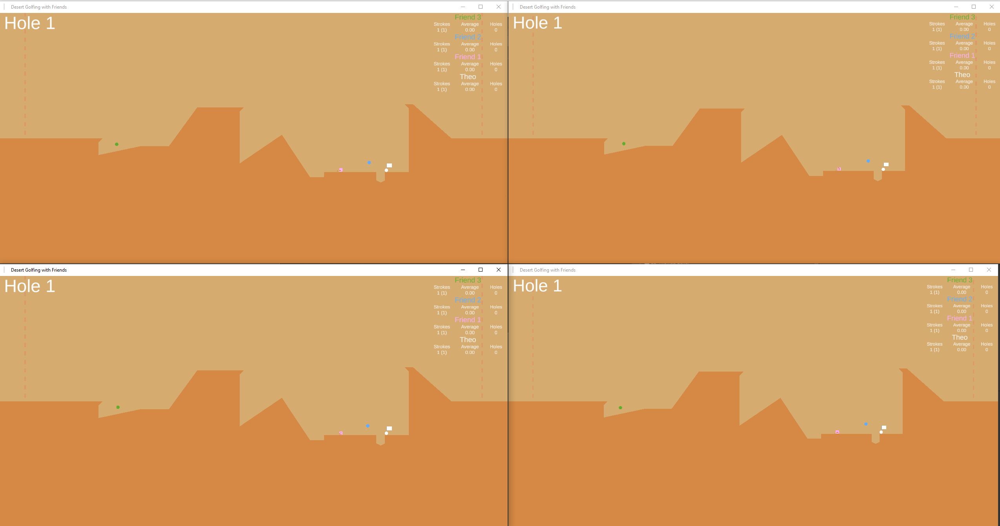

# Desert Golfing with Friends #

Play golf alone or with friends across an infinite desert of randomly generated courses.

- Customize the color and shape of the ball (Circle, Square, Hexagon)
- Play with up to 8 players (technically more... just change the value in one of the files)
- Infinite levels (kind of... most are very similar and the max level is ~2.14 Billion)

Builds for Windows and Linux are available:

https://drive.google.com/drive/folders/1Hn-UGsLEzCEGHchLs1GeljJg5E09E-fN?usp=sharing

If the builds in this folder do not work, you may need to build the project yourself.  Sorry!

## How to Play Multiplayer ##
This game requires port forwarding or some port forwarding work-around in order to be played over the internet.  The game defaults to port 7777, but you can change this at anytime in game.

## About ##
This project was made as an effort to learn more about MLAPI and Unity multiplayer programming.

There are no long term plans to continue development on this project, but the code will remain available here for anyone who is interested in expanding the idea further.

The game will always be available here for free!

## Checkout the Official Version of Desert Golfing ##
This game is a quick and dirty remake of the original Desert Golfing created by Justin Smith (but with multiplayer).

For a more artistic and polished experience, go check out the official version of Desert Golfing (Available on itch.io and Steam)!

You can find Justin's Itch.io page here: https://captaingames.itch.io/

## Software Versions ##

`Unity Engine` : 2021.2.9f1

`Netcode for GameObjects` : 1.0.0-pre.5

`Unity Transport for Netcode for GameObjects` : 1.0.0-pre.5

